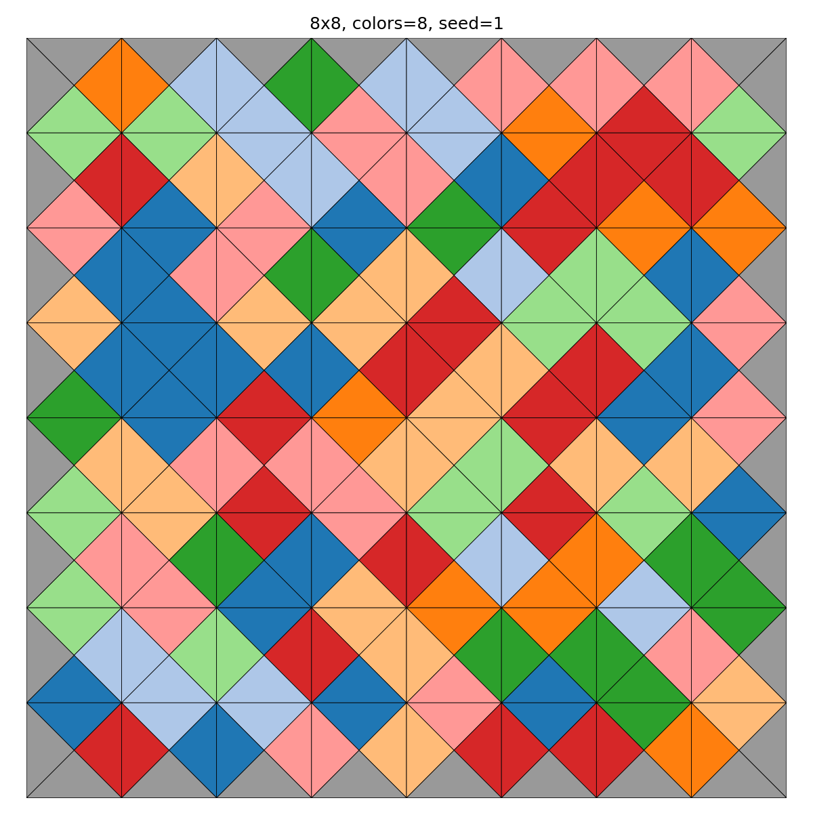
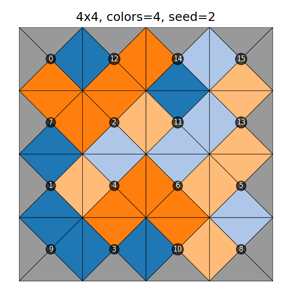

# Eternity II-Style Edge-Matching Puzzle Solver

A constraint-satisfaction / ILP solver for reduced-scale instances of
Eternity II-style edge-matching puzzles: square tiles with a color on
each of the four edges, where adjacent tiles must match colors along
their shared edge.

This project follows up on a university Proseminar (TU Dortmund, WiSe
2023/24) covering Burkardt & Garvie's ILP formulation for the original
1999 Eternity Puzzle. **Full-size Eternity II (16x16, 256 pieces) is
NP-hard and not the target here**: this project targets reduced
instances (roughly 3x3 up to 8-10x10, depending on what each approach
can actually solve in reasonable time) and reports honestly on where
the approach breaks down.

## Setup

```bash
pip install -e ".[dev,ilp,viz]"
```

## Try it

```bash
python scripts/solve_demo.py         # generate -> solve -> verify -> print, on a few small boards
python scripts/run_benchmark.py      # CP-SAT sweep across sizes/color counts -> benchmark_results.csv
python scripts/run_benchmark_ilp.py  # PuLP/CBC sweep (smaller range, see benchmark section)
python scripts/render_examples.py    # render the example boards below into assets/
pytest                                # generator + both solvers + verifier + renderer test suite
```

## Visualization

Each cell renders as a square split into four colored triangles (top,
right, bottom, left), one per edge. In a correct solution every
internal edge shows as a solid, unbroken diamond, since both triangles
meeting there share the same color; a visible seam would mean an
actual bug, not just a failed assertion in a test.



8x8, colors=8, seed=1: the same instance as the CP-SAT benchmark table
below. Solve time varies run to run (see the noise takeaway further
down); this particular run took 13.97s.

An optional piece-ID overlay helps for stepping through a solution by
hand, e.g. in an interview walkthrough:



Rendering is `render_solution()` in `src/eternity/visualize.py`;
`python scripts/render_examples.py` regenerates both images above.

## Modeling approach (CP-SAT)

This is a **pure feasibility problem**: find any valid placement, or
prove none exists. There's no objective function, which is also why a
successful solve reports `OPTIMAL`: with nothing to optimize, any
feasible point is trivially optimal.

### Sets and parameters

$$R = \{0,\dots,n_r-1\}, \quad C = \{0,\dots,n_c-1\}, \quad P = \{0,\dots,M-1\}, \quad K = \{0,1,2,3\}$$

where $M = n_r \cdot n_c$ is both the number of cells and the number
of pieces, and $K$ indexes clockwise quarter-turns. Piece $p$ has a
base edge tuple $(t_p, r_p, b_p, l_p)$ (top/right/bottom/left);
rotating $k$ steps clockwise cyclically shifts it to
$(t_p^k, r_p^k, b_p^k, l_p^k)$:

| $k$ | edges shown |
|---|---|
| 0 | $(t_p,\ r_p,\ b_p,\ l_p)$ |
| 1 | $(l_p,\ t_p,\ r_p,\ b_p)$ |
| 2 | $(b_p,\ l_p,\ t_p,\ r_p)$ |
| 3 | $(r_p,\ b_p,\ l_p,\ t_p)$ |

$\text{GRAY} = 0$; $\Gamma$ is the largest color value appearing in
the instance.

### Decision variables

$$x_{r,c,p,k} \in \{0,1\} \quad \forall (r,c)\in R\times C,\ p\in P,\ k\in K$$

$x_{r,c,p,k}=1$ iff piece $p$, rotated $k$ times, occupies cell
$(r,c)$.

Four auxiliary integer variables per cell, channeled to $x$ below,
hold the color actually displayed on each side once a piece is
placed:

$$T_{r,c},\ \mathrm{Rt}_{r,c},\ B_{r,c},\ L_{r,c} \in \{0,\dots,\Gamma\}$$

### Constraints

**1. Every cell holds exactly one (piece, rotation):**

$$\sum_{p\in P}\sum_{k\in K} x_{r,c,p,k} = 1 \qquad \forall (r,c)\in R\times C$$

**2. Every piece is used exactly once:**

$$\sum_{(r,c)\in R\times C}\sum_{k\in K} x_{r,c,p,k} = 1 \qquad \forall p\in P$$

Together, (1) and (2) force $x$ to encode a bijection between pieces
and cells. No separate all-different constraint is needed.

**3. Channeling: tie displayed colors to the chosen assignment.**
The code enforces this as an implication per assignment, via
`OnlyEnforceIf`:

$$x_{r,c,p,k}=1 \ \Rightarrow\ T_{r,c}=t_p^k,\ \ \mathrm{Rt}_{r,c}=r_p^k,\ \ B_{r,c}=b_p^k,\ \ L_{r,c}=l_p^k \qquad \forall (r,c,p,k)$$

Given constraint (1), this is mathematically equivalent to a single
weighted-sum equation per cell:

$$T_{r,c} = \sum_{p,k} t_p^k\, x_{r,c,p,k}, \quad \mathrm{Rt}_{r,c} = \sum_{p,k} r_p^k\, x_{r,c,p,k}, \quad B_{r,c} = \sum_{p,k} b_p^k\, x_{r,c,p,k}, \quad L_{r,c} = \sum_{p,k} l_p^k\, x_{r,c,p,k}$$

CP-SAT's reification is a natural fit since it's SAT-based under the
hood. CBC (the PuLP/CBC alternative, below) has no native reification
primitive, so that model uses the weighted-sum form instead: same
constraint, different syntax.

**4. Border edges must show GRAY:**

$$T_{0,c}=0\ \ \forall c\in C, \qquad B_{n_r-1,c}=0\ \ \forall c\in C, \qquad L_{r,0}=0\ \ \forall r\in R, \qquad \mathrm{Rt}_{r,n_c-1}=0\ \ \forall r\in R$$

**5. Adjacent cells agree on their shared edge:**

$$\mathrm{Rt}_{r,c} = L_{r,c+1} \quad \forall r\in R,\ c\in\{0,\dots,n_c-2\}$$

$$B_{r,c} = T_{r+1,c} \quad \forall r\in\{0,\dots,n_r-2\},\ c\in C$$

### Size

$|x| = M^2 \cdot 4 = 4M^2$ binary variables, plus 4 channeling
equations per $x$ variable. For a square board of side $n$ ($M=n^2$):
$4n^4$ variables and $16n^4$ constraints, the concrete source of the
CP-SAT blowup the benchmark phase will need to characterize.

See `src/eternity/solvers/cpsat_solver.py` for the implementation with
inline commentary.

## Modeling approach (PuLP/CBC ILP)

Same variables, same five constraint groups as above:
`src/eternity/solvers/ilp_solver.py` implements the identical model,
just for a general-purpose ILP solver instead of a CP engine. Two real
differences from the CP-SAT version:

- **No reification.** Constraint 3 is written for CBC exactly as the
  weighted-sum form already given:
  `top[r,c] == sum_{p,k} t_p^k * x[r,c,p,k]`, and likewise for
  right/bottom/left.
- **No objective.** The problem is pure feasibility, so PuLP is given
  a constant `0` objective. Because the objective never varies, CBC
  recognizes zero optimality gap the moment it finds *any* feasible
  integer solution, so on these instances "Optimal" and "first
  solution found" happen at essentially the same moment.

**On "closer to the academic paper": it isn't, and that's worth being
precise about.** Burkardt & Garvie's ILP (see Reference) solves the
*original 1999 Eternity Puzzle*, a geometric exact-cover problem
where 209 uniquely-shaped "polydrafter" pieces (made of 30-60-90
triangles) must exactly tile an irregular dodecagon. Their model has
one binary variable per candidate (piece, orientation, position)
placement and one linear equation per unit triangle of the region,
requiring it to be covered exactly once. That's a different
combinatorial structure from Eternity II's edge-matching puzzle: their
constraint is "every unit of area is covered once," ours is "every
shared edge shows the same color on both sides." One doesn't reduce to
the other, so this project does not implement their formulation. What
carries over is their *style*: a flat 0-1 ILP with explicit linear
constraints, solved by a general-purpose solver (they used CPLEX; this
project uses open-source CBC) rather than a CP-specific engine with
reification.

## Benchmark results

Both solvers ran on the exact same reverse-constructed instances (same
seed), so the two tables below are directly comparable. Harness in
`src/eternity/benchmark.py`; reproduce with `python
scripts/run_benchmark.py` and `python scripts/run_benchmark_ilp.py`
(both write to `benchmark_results.csv`). All OPTIMAL/Optimal results
below were verified independently via `verify.py`.

### CP-SAT

3x3 through 10x10, two color-count settings per size ("tight": colors
= n, "loose": colors = 2n).

| size | colors | status | solve time |
|---|---|---|---|
| 3x3 | 3 (tight) | OPTIMAL | 0.04s |
| 3x3 | 6 (loose) | OPTIMAL | 0.02s |
| 4x4 | 4 (tight) | OPTIMAL | 0.08s |
| 4x4 | 8 (loose) | OPTIMAL | 0.04s |
| 5x5 | 5 (tight) | OPTIMAL | 0.51s |
| 5x5 | 10 (loose) | OPTIMAL | 0.10s |
| 6x6 | 6 (tight) | OPTIMAL | 1.13s |
| 6x6 | 12 (loose) | OPTIMAL | 0.12s |
| 7x7 | 7 (tight) | OPTIMAL | 6.06s |
| 7x7 | 14 (loose) | OPTIMAL | 0.38s |
| 8x8 | 8 (tight) | OPTIMAL | 17.97s |
| 8x8 | 16 (loose) | OPTIMAL | 1.12s |
| 9x9 | 9 (tight) | UNKNOWN (timed out) | 90.06s (cap) |
| 9x9 | 18 (loose) | OPTIMAL | 9.79s |
| 10x10 | 10 (tight) | UNKNOWN (timed out) | 60.09s (cap) |
| 10x10 | 20 (loose) | OPTIMAL | 13.10s |

### PuLP/CBC ILP

Same instances, 3x3 through 6x6. Extending further would just burn
time on cases already known to time out (see takeaways).

| size | colors | status | solve time |
|---|---|---|---|
| 3x3 | 3 (tight) | Optimal | 0.02s |
| 3x3 | 6 (loose) | Optimal | 0.01s |
| 4x4 | 4 (tight) | Optimal | 0.65s |
| 4x4 | 8 (loose) | Optimal | 0.07s |
| 5x5 | 5 (tight) | Optimal | 5.33s |
| 5x5 | 10 (loose) | Optimal | 2.34s |
| 6x6 | 6 (tight) | Not Solved (timed out) | 120.03s (cap) |
| 6x6 | 12 (loose) | Optimal | 46.59s |

### Seed variance

The two tables above use one seed per configuration, and it turned out
those single numbers aren't trustworthy on their own. To find out how
much they vary, three more seeds were run per size at the "tight"
(colors = n) setting: 5x5 through 8x8 for CP-SAT, 3x3 through 5x5 for
CBC. Raw data in `benchmark_variance.csv`.

**CP-SAT (tight):**

| size | min | median | max | spread (max/min) |
|---|---|---|---|---|
| 5x5 | 0.10s | 0.32s | 0.38s | 4.0x |
| 6x6 | 0.92s | 0.96s | 0.98s | 1.1x |
| 7x7 | 5.61s | 6.05s | 8.09s | 1.4x |
| 8x8 | 11.28s | 50.79s | 141.86s | 12.6x |

**PuLP/CBC (tight):**

| size | min | median | max | spread (max/min) |
|---|---|---|---|---|
| 3x3 | 0.01s | 0.01s | 0.01s | 1.2x |
| 4x4 | 0.03s | 0.57s | 0.92s | 31.3x |
| 5x5 | 1.86s | 5.45s | 15.49s | 8.3x |

The 8x8 CP-SAT row matters most: the single-seed table above shows
17.97s, which reads like a comfortably solved size. Three more seeds
ranged from 11s to 142s, and the slow one needed a 180s budget (three
times the original 60s cap) before it finished. Every 8x8 tight
instance tried did eventually solve, so 8x8 isn't actually beyond
CP-SAT's reach, but "solves in about 18s" was never a fair
characterization of the size; it was one sample from a wide
distribution. CBC shows the same pattern even more sharply: a 31x
spread at 4x4, on instances that only take a second either way. A
single seed is not a reliable read on a configuration's difficulty,
for either solver.

### Infeasibility check

`make_infeasible_instance()` (in `generator.py`) builds a provably
infeasible instance without needing a solver run to confirm it: it
takes a normal solvable instance and changes one GRAY edge on one
piece to a color that appears nowhere else. A solvable n x n board
needs exactly 4n GRAY edges spread across its pieces (one per
border-facing slot); after the change there are only 4n - 1, so by a
simple counting argument at least one border slot cannot end up GRAY,
whatever arrangement is tried. That holds independent of solver
internals, which makes it a good check that "no solution exists" gets
reported correctly rather than confused with "ran out of time."

**CP-SAT:**

| size | status | time |
|---|---|---|
| 3x3 | INFEASIBLE | 0.02s |
| 4x4 | INFEASIBLE | 0.02s |
| 5x5 | INFEASIBLE | 0.07s |
| 6x6 | INFEASIBLE | 0.20s |
| 7x7 | INFEASIBLE | 0.36s |
| 8x8 | INFEASIBLE | 1.27s |
| 9x9 | INFEASIBLE | 9.24s |
| 10x10 | INFEASIBLE | 12.86s |

**PuLP/CBC** (tested at smaller sizes, matching its practical range):

| size | status | time |
|---|---|---|
| 3x3 | Infeasible | 0.57s |
| 4x4 | Infeasible | 0.02s |
| 5x5 | Infeasible | 0.04s |

Both solvers report the correct status at every size tested, never a
timeout. Worth noting: proving infeasibility at 9x9 and 10x10 (9.24s,
12.86s) is far faster than the single-seed *solvable* tight instances
at those same sizes ever managed (they hit their 90s and 60s caps and
came back UNKNOWN, see the CP-SAT table above). That's not a
contradiction: "prove no valid tiling exists" and "find one specific
valid tiling among an astronomically large space of near-misses" are
different computational problems. This particular kind of
infeasibility, a global counting/pigeonhole violation, is one
CP-SAT's propagation catches quickly, well before it would need to
explore anything like the search space a hard solvable instance
requires.

Regression-tested in `tests/test_core.py`
(`test_cpsat_proves_infeasibility_not_timeout`,
`test_ilp_proves_infeasibility_not_timeout`).

### Takeaways

- **CP-SAT dominates once problems are non-trivial, but not at the
  very smallest sizes.** At 3x3, CBC was actually slightly *faster*
  than CP-SAT (0.02s vs 0.04s tight). CP-SAT's parallel portfolio
  search has fixed per-solve overhead (spinning up 8 worker threads)
  that a trivial problem doesn't amortize. The crossover happens by
  4x4, where CP-SAT is already about 8x faster, and the gap widens
  fast: by 6x6 loose it's roughly 386x (0.12s vs 46.59s), and at 6x6
  tight CBC didn't finish within its 120s cap at all, while CP-SAT
  took 1.13s.
- **Why:** this is a highly combinatorial assignment/matching problem
  with a lot of symmetry (many pieces are interchangeable under the
  "tight" color setting), and CP-SAT's SAT-based propagation is built
  for exactly that: it prunes using logical inference across the
  boolean channeling variables, not just an LP relaxation bound.
  Classical branch-and-bound MIP solvers like CBC tend to do best when
  the LP relaxation is tight; ours isn't, because "exactly one of
  these many near-symmetric booleans is 1" gives a weak fractional
  bound to branch on.
- **Color count still matters more than board size for both solvers.**
  Tight instances are consistently slower than loose ones at the
  same size, for the same reason noted in the CP-SAT-only findings
  from Phase 2.
- **UNKNOWN (CP-SAT) and "Not Solved" (CBC) both mean "ran out of
  time," never "possibly unsolvable."** Every instance is generated
  via reverse construction (see `generator.py`), so a solution is
  guaranteed to exist, and the separate infeasibility check above
  confirms both solvers report genuine infeasibility distinctly from
  a timeout when a solution truly doesn't exist.
- **Single-seed timings understate the real variance, badly at some
  sizes.** See the seed variance section above: a single 8x8 CP-SAT
  sample can be off by more than 12x from another equally valid
  sample at the identical size and color count. Any claim about
  "where an approach breaks down" should be read as a rough band,
  not a precise line, unless it's backed by multiple seeds.

## Layout

```
src/eternity/
  model.py                # Piece, PuzzleInstance, rotation logic
  generator.py             # reverse-construction instance generator
  verify.py                # independent solution checker
  benchmark.py             # sweep harness -> CSV
  visualize.py             # render solved boards to PNG
  solvers/
    cpsat_solver.py         # OR-Tools CP-SAT model
    ilp_solver.py            # PuLP/CBC ILP model
scripts/
  solve_demo.py             # end-to-end smoke test
  run_benchmark.py          # CP-SAT sweep
  run_benchmark_ilp.py      # PuLP/CBC sweep
  render_examples.py        # regenerates assets/*.png
tests/                      # pytest suite
assets/                     # example rendered boards (used in this README)
benchmark_results.csv      # latest single-seed sweep, both solvers
benchmark_variance.csv     # multi-seed variance check (see benchmark section)
```

## Reference

Burkardt, J., & Garvie, M. R. (2023). An integer linear programming
approach to solving the Eternity Puzzle. *Theoretical Computer
Science*, 975, 114138. https://doi.org/10.1016/j.tcs.2023.114138

Their paper addresses the *original 1999 Eternity Puzzle*
(Christopher Monckton's geometric tiling puzzle: 209 unique
polydrafter pieces exactly covering an irregular dodecagon), not
Eternity II's edge-matching puzzle, which is what this project
implements. See "On 'closer to the academic paper'" above for exactly
what does and doesn't carry over between the two.
